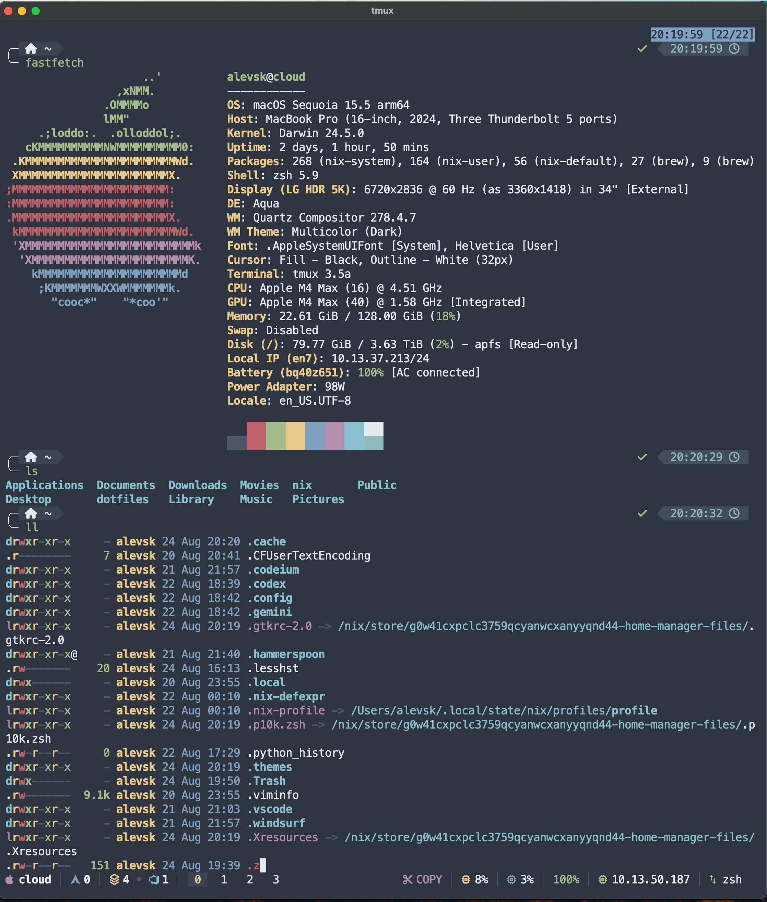

# Alevsk's Nix Darwin Configuration

Declarative macOS setup using Nix Darwin + Home Manager with integrated theming.



## 📁 Project Structure

```
~/nix/
├── flake.nix                  # Flake with nix-darwin, home-manager, stylix, nix-homebrew
├── darwin-configuration.nix   # Host-level config (imports modules/system/default.nix)
├── home.nix                   # User-level config (Home Manager)
├── modules/                   # Modular configs
│   ├── system/                # nix-darwin (system) modules
│   │   ├── default.nix        # Aggregator: imports sibling system modules
│   │   ├── core.nix           # Core: nix/nixpkgs/programs/terminfo
│   │   ├── defaults.nix       # macOS defaults (Dock + UI)
│   │   ├── packages.nix       # environment.systemPackages (CLI/dev tools)
│   │   ├── homebrew.nix       # Homebrew brews/casks (+ activation prefs)
│   │   ├── fonts.nix          # System fonts
│   │   ├── applications.nix   # Alias Nix + HM apps into /Applications
│   │   └── proxychains.nix    # Proxychains (optionized)
│   ├── cli/                   # CLI tools (Home Manager)
│   │   ├── fzf.nix            # FZF
│   │   ├── gcloud.nix         # Google Cloud SDK
│   │   └── lf/                # lf file manager (lfrc, icons, preview)
│   ├── desktop/wallpaper.nix  # Wallpaper setup (Home Manager)
│   ├── editor/neovim.nix      # Neovim + theme (Home Manager)
│   ├── git/git.nix            # Git (Home Manager)
│   ├── multiplexer/tmux.nix   # Tmux + statusline (Home Manager)
│   ├── shell/zsh.nix          # Zsh + Powerlevel10k (Home Manager)
│   └── terminal/alacritty.nix # Alacritty (Home Manager)
└── scripts/
    ├── switch-theme.sh        # Interactive theme/prompt switcher
    └── tmux-stats.sh          # Tmux helper
```

## 🚀 Quick Start

- Install Nix:
  - `curl --proto '=https' --tlsv1.2 -sSf -L https://install.determinate.systems/nix | sh -s -- install`
- Bootstrap nix-darwin (first time only):
  - `sh -c "$(curl -L https://github.com/LnL7/nix-darwin/releases/latest/download/install)"`
- Apply configuration:
  - `cd ~/nix && sudo darwin-rebuild switch --flake .#cloud`
  - `home-manager switch --flake .#alevsk`

## 🔁 Daily Usage

- System changes: `sudo darwin-rebuild switch --flake ~/nix#cloud`
- User changes: `home-manager switch --flake ~/nix#alevsk`
- Helpful aliases (available in the shell):
  - `rebuild-system`, `rebuild-home`, `rebuild-all`, `switch-theme`, `nix-gc`

## ➕ Add Packages

- Nix (system): edit `modules/system/packages.nix`
  - `environment.systemPackages = with pkgs; [ my-package ];` (keep list alphabetized)
- Nix (user): edit `home.nix`
  - `home.packages = with pkgs; [ my-package ];`
- Homebrew (CLI): edit `modules/system/homebrew.nix`
  - `homebrew.brews = [ "my-brew" ];` (keep list alphabetized)
- Homebrew (Apps): edit `modules/system/homebrew.nix`
  - `homebrew.casks = [ "my-app" ];` (keep list alphabetized)

## 🧰 Apply/Bootstrap Notes

- Flake attributes: system `.#cloud`, user `.#alevsk`.
- Homebrew is integrated via `nix-homebrew` in flake.nix and configured in `modules/system/homebrew.nix`.
- Dock items and application aliases are created during system activation (see `modules/system/applications.nix`).
- Both system (nix-darwin) and user (Home Manager) apps are aliased into `/Applications` so Spotlight/Launchpad can find them easily.

## 📦 Package Policy

- Use Nix for CLI/dev tools and libraries (reproducible, easy pinning via flakes).
- Use Homebrew for GUI apps/macOS bundles (better support and updates for many apps).
- Dock apps should point to Homebrew-managed apps under `/Applications` where possible (exceptions allowed by choice).

## 🧿 App Aliasing Behavior

- The activation script aliases:
  - System apps from `environment.systemPackages`’ `*/Applications/*.app` into `/Applications`.
  - Home Manager apps from all `*home-manager-applications*/Applications/*.app` into `/Applications`.
- This provides a single UX surface in `/Applications`; HM’s default `~/Applications/Home Manager Apps` may also exist but `/Applications` is considered primary in this setup.

## 🔄 Maintenance

- Update inputs: `nix flake update`
- Garbage collect: `nix-collect-garbage -d`
- Validate flake: `nix flake check`
- Inspect flake: `nix flake show`
- Search packages: `nix search nixpkgs <name>`
- Rollback: `sudo darwin-rebuild rollback` (system), `home-manager rollback` (user)

## 🎨 Theming

- Fast switch (interactive): run `switch-theme` or `~/nix/scripts/switch-theme.sh`
- Manual edit: update in `home.nix`
  - `currentThemeName = "nord";`    # nord, dracula, tokyonight, ocean, default
  - `promptStyle = "lean";`         # lean, classic, rainbow
  - `autoStartTmux = false;`         # auto-start tmux on new terminals
- Apply theme changes: `home-manager switch --flake ~/nix#alevsk`
- Integration: Stylix + nix-colors propagate colors to Zsh, tmux, fzf, Neovim, Alacritty.

## 🔧 Module Locations

- Zsh: `modules/shell/zsh.nix`
- Alacritty: `modules/terminal/alacritty.nix`
- Neovim: `modules/editor/neovim.nix`
- Git: `modules/git/git.nix`
- Tmux: `modules/multiplexer/tmux.nix`
- FZF: `modules/cli/fzf.nix`
- lf: `modules/cli/lf/`
- Wallpaper: `modules/desktop/wallpaper.nix`

## 🐛 Troubleshooting

- Use `sudo` with `darwin-rebuild` for system changes.
- Ensure you run from `~/nix` or point `--flake` at the repo.
- If builds fail, check `.nix` syntax and attribute names (`cloud`, `alevsk`).

## 📚 Resources

- Nix packages: https://search.nixos.org/
- nix-darwin: https://github.com/LnL7/nix-darwin
- Home Manager: https://github.com/nix-community/home-manager
- Stylix: https://github.com/nix-community/stylix
- nix-colors: https://github.com/Misterio77/nix-colors
