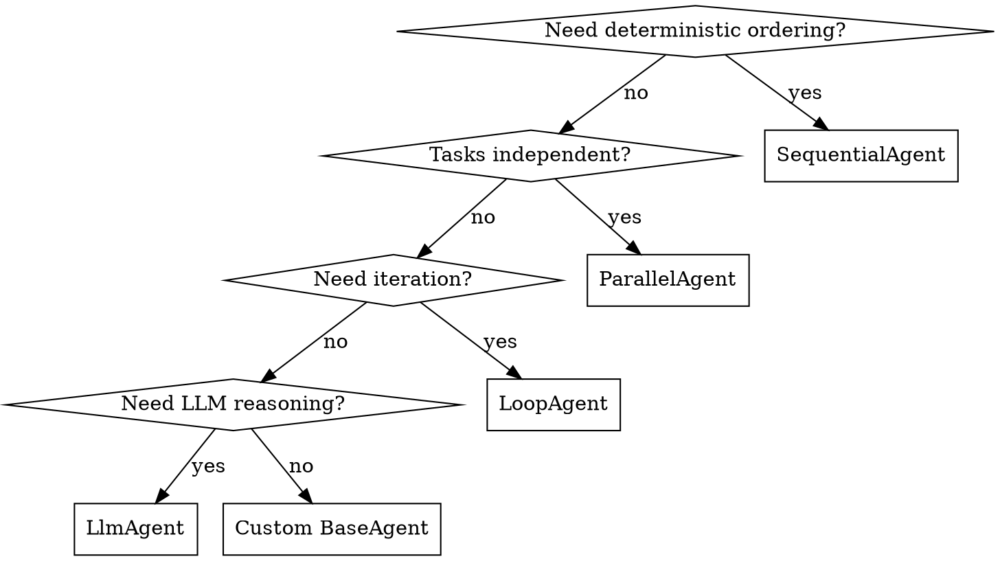

# ADK Agent Patterns

Architecture patterns for Google ADK (Agent Development Kit). Framework-first — embrace ADK primitives before building custom solutions.

## Agent Type Selection



| Agent Type | Use When | Anti-Pattern |
|-----------|----------|-------------|
| `SequentialAgent` | Phase ordering must be deterministic | Using for independent tasks (adds latency) |
| `ParallelAgent` | Tasks are independent, can run concurrently | Agents writing to same state key (race conditions) |
| `LoopAgent` | Iterative refinement with `max_iterations` | No max cap or escalation exit (infinite loops) |
| `LlmAgent` | Flexible reasoning, tool selection, NL processing | Using for flow orchestration (non-deterministic) |
| `BaseAgent` subclass | None of the above fit | Building custom before exhausting built-ins |

**Design philosophy:** Deterministic skeleton (WorkflowAgents control flow), autonomous flesh (LlmAgents decide within each phase).

## Callback Contracts

### Signatures and Return Values (Non-Negotiable)

| Callback Type | Signature | Return None = | Return Value = |
|--------------|-----------|---------------|----------------|
| `before_model_callback` | `(ctx: CallbackContext, req: LlmRequest) -> LlmResponse \| None` | Proceed to LLM | Short-circuit, skip LLM call |
| `before_tool_callback` | `(tool: BaseTool, args: dict, ctx: ToolContext) -> None` | Proceed (mutate args in place) | — |
| `after_tool_callback` | `(tool: BaseTool, args: dict, ctx: ToolContext, resp: dict) -> dict \| None` | Accept response as-is | Replace response with returned dict |
| `on_tool_error_callback` | `(tool: BaseTool, args: dict, ctx: ToolContext, err: Exception) -> dict \| None` | Propagate error | Recover — returned dict triggers `after_tool_callback` |
| `on_model_error_callback` | `(ctx: CallbackContext, err: Exception) -> LlmResponse \| None` | Propagate error | Recover with replacement response |

### Callback Lists — Order is Execution Order

ADK executes callbacks in list order. Any callback returning a value short-circuits the rest. This creates **ordering invariants** that must be enforced:

```python
# Critical ordering rules:
after_tool_callback=[
    record_tool_outcome,        # (1) Record before compaction strips data
    store_injection_points,     # (2) Read injection_points before compaction
    detect_zero_findings,       # (3) Read finding_count before compaction
    compact_tool_output,        # LAST — returns dict, short-circuits chain
]
```

**Enforcement:** Add a test that asserts ordering invariants:

```python
def test_compact_always_last():
    for agent in pipeline_agents:
        callbacks = agent.after_tool_callback
        assert callbacks[-1] is compact_tool_output, f"{agent.name}: compact not last"
```

### Single Responsibility Per Callback

Each callback does ONE thing. Composing behavior = adding another callback to the list.

| Pattern | Purpose | Example |
|---------|---------|---------|
| Guardrail | Block policy violations | `enforce_tool_policy` — dedup, timeout floors |
| State Writer | Persist data for later phases | `store_injection_points` — session state |
| Advisor | Inject guidance into LLM prompt | `inject_tool_progress` — coverage advisory |
| Transformer | Modify request/response data | `compact_tool_output` — strip verbose fields |
| Monitor | Track metrics without side effects | `record_tool_usage` — coverage tracking |

### Shared Helper Extraction

When 3+ callbacks duplicate the same logic, extract a helper:

```python
# callbacks/_llm_request_helpers.py
def append_to_system_instruction(llm_request: LlmRequest, text: str) -> None:
    """Append advisory text to system instruction, handling str and Parts types."""
    existing = llm_request.config.system_instruction
    if isinstance(existing, str):
        llm_request.config.system_instruction = existing + text
    elif hasattr(existing, "parts"):
        parts = getattr(existing, "parts", None) or []
        if parts and hasattr(parts[0], "text"):
            parts[0].text = (parts[0].text or "") + text
```

## State Management

### ADK Prefix Scoping Convention

| Prefix | Scope | Persistence | Use For |
|--------|-------|-------------|---------|
| (none) | Current session | SessionService-dependent | Phase outputs, findings |
| `temp:` | Current invocation only | Never persists | Intermediate calculations |
| `user:` | All sessions for user | Always persists | User preferences |
| `app:` | Global | Always persists | Feature flags |

### Project State Key Pattern

Centralize all state keys in one module. Import everywhere:

```python
# callbacks/session_keys.py
from enum import StrEnum

class SK(StrEnum):
    """Session state keys — single source of truth."""
    # Auth (written by auto_login, read by preflight)
    AUTO_LOGIN_DONE = "auto_login_completed"
    PREFLIGHT_COOKIES = "_preflight:cookies"
    PREFLIGHT_BASE_URL = "_preflight:base_url"

    # Coverage (written by recon callbacks, read by vuln_analysis)
    COVERAGE_EXPECTED = "_coverage:expected_endpoints"
    COVERAGE_TESTED = "_coverage:tested_endpoints"

    # Injection passthrough (written by recon, read by vuln_discovery)
    INJECTION_POINTS = "_passthrough:injection_points"
    INJECTION_INDEX = "_passthrough:injection_index"
```

**Rules:**
- All state reads/writes use `SK.KEY_NAME`, never raw strings
- Adding a new key = adding it to the StrEnum first
- Keys with `_` prefix are internal pipeline keys (not in ADK's `temp:`/`user:`/`app:` convention — evaluate migrating if keys don't need to survive across SequentialAgent phases)

### State Modifications

Always modify via `context.state` (auto-tracked in `state_delta`):

```python
# In callbacks/tools — changes auto-captured
tool_context.state[SK.COVERAGE_TESTED] = tested_endpoints

# NOT this — bypasses event tracking
ctx.session.state["key"] = value  # Wrong in callbacks
```

## Tool Registration

### Annotation Rules (Python 3.14+ / ADK Constraint)

| Rule | Reason |
|------|--------|
| Never `param: Any = default` | ADK calls `isinstance(default, annotation)` — crashes with `Any` in Python 3.14 |
| Use `object` for generic params | `isinstance(x, object)` always works |
| Compound `dict[str, Any]` is fine | Not used as `isinstance` target |
| `list[T] \| str \| None` for MCP params | LLMs send lists as strings; MCP server must coerce |

### Error Guard Wiring (Non-Negotiable)

Every agent MUST have both:

```python
Agent(
    before_tool_callback=[unknown_tool_guard, ...],    # Log unregistered tools
    on_tool_error_callback=unknown_tool_error_handler,  # Catch ValueError from _get_tool()
)
```

**Why:** ADK raises `ValueError` in `_get_tool()` BEFORE `before_tool_callback` fires. Only `on_tool_error_callback` can intercept tool lookup failures.

### Registry-Driven Tool Config

Centralize tool behavior in a registry. Callbacks import from it with fail-open:

```python
try:
    from security_tools.tool_registry import DEDUP_TOOLS, TIMEOUT_FLOORS
except ImportError:
    DEDUP_TOOLS: set[str] = set()     # Fail-open
    TIMEOUT_FLOORS: dict[str, int] = {}
```

## Context Engineering

### Three-Layer Compression

| Layer | When | What | Implementation |
|-------|------|------|----------------|
| Layer 1: Post-Tool | `after_tool_callback` | Strip `raw_output`, `stderr`, truncate lists | `compact_tool_output` |
| Layer 2: Pre-LLM | `before_model_callback` | Compress old tool results when approaching budget | `context_budget_callback` |
| Layer 3: Text Truncation | Within Layer 2 | Truncate verbose LLM reasoning from old turns | `_truncate_model_text_parts` |

### KV-Cache Preservation

| Do | Don't |
|----|-------|
| Keep system instruction prefix stable | Prepend dynamic content to system_instruction |
| Append advisories to end of message history | Modify system_instruction on every turn |
| Use `output_key` for phase outputs | Store large outputs in context directly |

### Attention Management (50+ Step Sessions)

Restate objectives every N turns to prevent goal drift:

```python
def inject_objective_restatement(ctx, llm_request):
    turn_count = ctx.state.get("_turn_count", 0)
    if turn_count > 0 and turn_count % 10 == 0:
        append_to_system_instruction(llm_request,
            f"\n\n[REMINDER] Target: {ctx.state.get('target')} | "
            f"Phase: {ctx.state.get('current_phase')} | "
            f"Remaining: {ctx.state.get('remaining_phases')}")
```

## Multi-Agent Orchestration Patterns

| Pattern | ADK Primitive | Key Consideration |
|---------|---------------|-------------------|
| Sequential Pipeline | `SequentialAgent` | Phases communicate via `session.state` + `output_key` |
| Coordinator/Dispatcher | `LlmAgent` + `sub_agents` | Agent `description` is the routing API — make it distinct |
| Parallel Fan-Out | `ParallelAgent` | Each sub-agent writes to unique `output_key` |
| Hierarchical | `AgentTool` wrapping | For tasks exceeding single-agent context |
| Generator-Critic | `SequentialAgent` in `LoopAgent` | Binary pass/fail validation |
| Iterative Refinement | `LoopAgent` + `max_iterations` | Always set `max_iterations`; exit via `escalate=True` |

### Agent Description as API (Non-Negotiable)

```python
# Bad — vague, overlapping with other agents
description="Handles security scanning"

# Good — specific capabilities, clear boundaries
description="Discovers vulnerabilities using sqlmap (SQL injection), dalfox (XSS), commix (command injection), and nikto (web server misconfig). Requires reconnaissance data from Phase 1."
```

## MCP Integration

### Timeout Chain Invariant

```
tool_wrapper_timeout ≤ sse_read_timeout ≤ gateway_output_timeout
```

- `ToolDefinition.mcp_wrapper_timeout_seconds` — per-tool in registry (default 1200s)
- `mcp_gateway_sse_read_timeout` — httpx SSE keep-alive (default 1500s)
- Supergateway `--outputTimeout` — in Dockerfile (default 1200s)

### Type Coercion for LLM Arguments

LLMs send `list[int]` as `"[200, 301]"`. All MCP server list params:

```python
# MCP server function signature
def scan(target: str, status_codes: list[int] | str | None = None) -> dict:
    if isinstance(status_codes, str):
        status_codes = json.loads(status_codes)
```

### Single SSE Client Limitation

Supergateway supports ONE SSE client per instance. Design fallback paths (container_tools) for when MCP gateway is occupied.

## Testing Pyramid for ADK Agents

| Level | What | How | Determinism |
|-------|------|-----|-------------|
| Unit | Callbacks, tools, state logic | pytest + mock contexts | Deterministic |
| Component | Single agent with mocked LLM | ADK test harness, scripted responses | Semi-deterministic |
| Integration | Full pipeline with real LLM | `run_assessment.py`, real targets | Non-deterministic |
| Evaluation | Statistical quality metrics | `pass@k`, `pass^k` over N runs | Statistical |

### Critical Tests for ADK Projects

```python
# 1. Callback ordering invariants
def test_compact_always_last():
    assert recon_agent.after_tool_callback[-1] is compact_tool_output

# 2. All agents have error guards
def test_all_agents_have_error_guard():
    for agent in all_pipeline_agents:
        assert agent.on_tool_error_callback is not None

# 3. State key consistency
def test_state_keys_are_centralized():
    # grep for raw string state access outside session_keys.py
    ...
```

## Common Mistakes

| Mistake | Fix |
|---------|-----|
| Using `LlmAgent` for deterministic flow control | Use `SequentialAgent` / `ParallelAgent` |
| Callback modifies `session.state` directly | Use `context.state` (auto-tracked) |
| Missing `on_tool_error_callback` | Always wire both `before_tool_callback` + `on_tool_error_callback` |
| Dynamic system_instruction changes on every turn | Append to message history instead; preserve KV-cache |
| No `max_iterations` on `LoopAgent` | Always set a cap with `escalate=True` exit |
| `output_schema` + `tools` on same agent | Unreliable on most models — use one or the other |
| Agent named `user` | Reserved name in ADK — will cause routing issues |
| Inline prompts in agent code | Externalize to `.adk/prompts/*.md` — versionable, reviewable |
